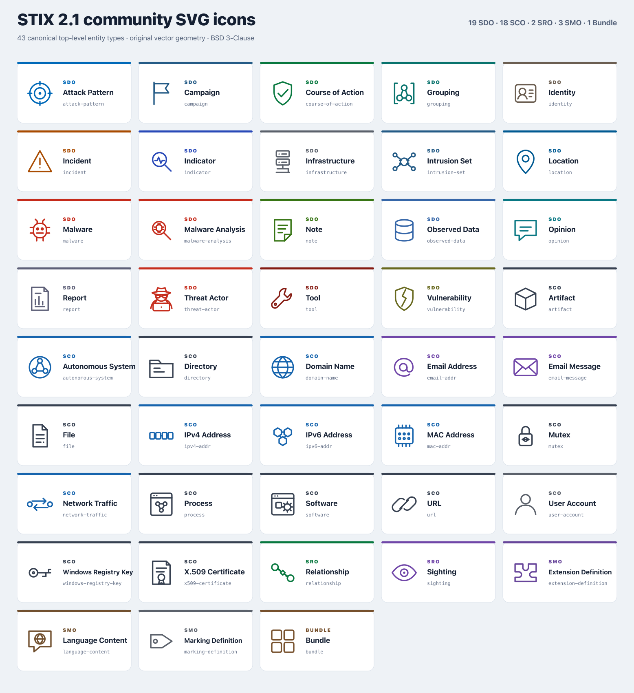
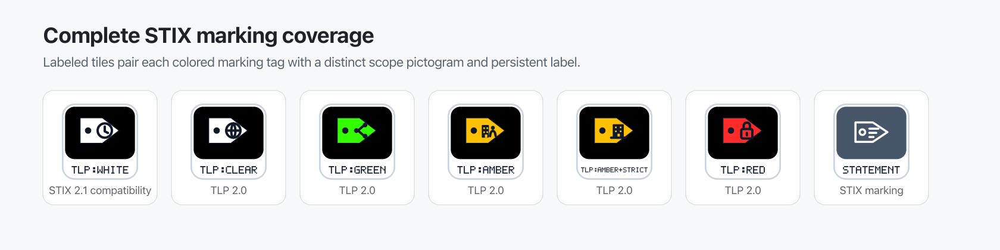
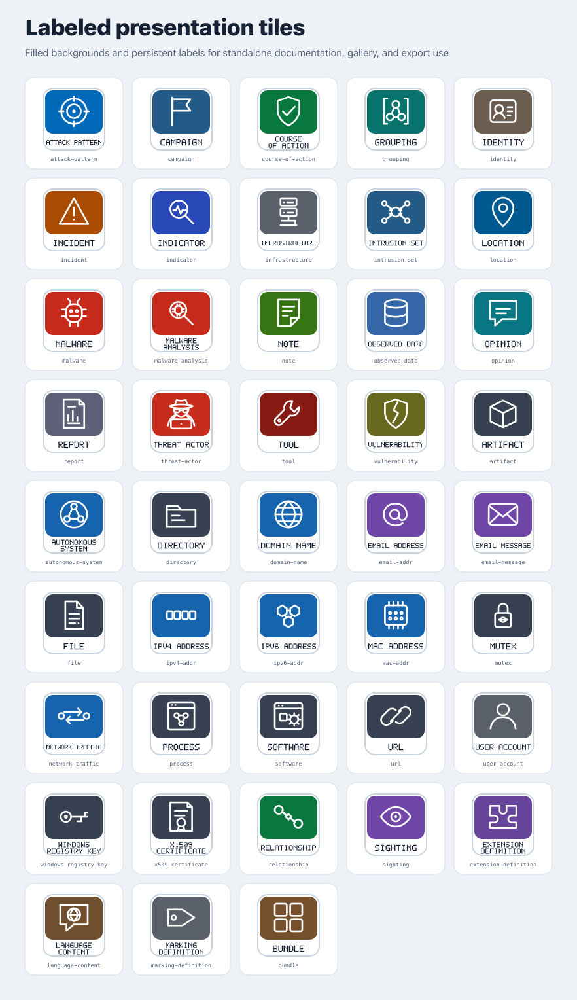

# STIX 2.1 Community SVG Icons

An original, vector-native icon and badge family for STIX 2.1 applications.

## Demo

[](preview/catalog.png)

The 43 entity icons are the core artwork layer:

- 18 fully defined STIX Domain Objects, plus the STIX 2.1 Incident stub
- 18 STIX Cyber-observable Objects
- 2 STIX Relationship Objects
- 3 STIX Meta Objects
- 1 STIX Bundle Object

“43 of 43” means complete canonical top-level entity coverage. It does not
mean complete application support: markings, object extensions, extension-
defined objects, state indicators, aliases, and custom fallbacks require
additional assets and resolver logic.

## Asset taxonomy

The inventory separates assets by their role:

- **Entities:** the 43 canonical top-level STIX 2.1 visual mappings.
- **Marking variants:** Statement plus the four STIX 2.1 TLP markings
  (`WHITE`, `GREEN`, `AMBER`, and `RED`), with current FIRST TLP 2.0
  presentation support for `CLEAR` and `AMBER+STRICT`.
- **Predefined extension badges:** the 12 STIX 2.1 object extensions, displayed
  on their File, Network Traffic, Process, or User Account parent rather than
  as independent graph nodes.
- **Candidate-extension objects:** `event`, `impact`, `task`, and
  `observed-string`. These are explicitly labeled extension-defined objects,
  not canonical STIX 2.1 entities.
- **Marking-extension badges:** generic CUI, PAP, and IEP treatments selected
  by Extension Definition ID.
- **State and property indicators:** `defanged`, `revoked`,
  `granular-marking`, and `language-marking`.
- **Fallbacks and aliases:** category-specific custom-object fallbacks, a
  custom-extension fallback, and mappings for established upstream names.

Compatibility aliases include `coa` → `course-of-action`, `language` →
`language-content`, `http` → `http-request-ext`, and generic `tlp`. Historical
visualizer concepts such as `source`, `victim`, and `victim-target` remain
legacy presentation assets rather than canonical STIX types.

## Design contract

Entity, extension-object, and ordinary badge artwork follows this contract:

- Original geometry; no traced or embedded third-party artwork.
- `64 × 64` coordinate system with `viewBox="0 0 64 64"`.
- Monochrome `currentColor` rendering.
- Three-unit primary stroke with rounded caps and joins.
- No fonts, raster images, scripts, external resources, or transformations.
- Recognizable at 24, 48, and 96 CSS pixels.
- A human-readable `<title>` and `aria-label` in every file.
- Kebab-case canonical filenames, with aliases recorded separately.

Color belongs to consuming applications. The optional profiles in
`design/color-scheme.json`, `design/color-scheme.css`, and `design/COLOR.md`
provide a neutral default and a non-normative type-level compatibility theme.
Consumers that load an SVG as an external image or draw it onto a canvas must
apply colors while generating the image resource; an external SVG does not
inherit `currentColor` from the surrounding page.

TLP badges are the intentional semantic exception to the monochrome contract.
Their glyphs use the applicable FIRST display colors as filled STIX marking
tags, plus original path-drawn scope pictograms. These pictograms are
non-normative community artwork: the applicable FIRST color and literal
uppercase TLP label remain authoritative. Consuming interfaces must place that
complete label alongside the glyph and expose an accessible native name, so
neither color nor the illustrative cue carries the meaning alone.
STIX 2.1 `TLP:WHITE` is
preserved as a serialization-compatibility presentation and must not be
silently rewritten to current TLP 2.0 `TLP:CLEAR`.

[](preview/pr-screenshots/tlp-variants.png)

Embedded SVG metadata improves the standalone files, but it is not sufficient
application accessibility when an icon is loaded as an image or painted on a
canvas. Consuming applications must expose an accessible node, legend, or
badge name independently of the SVG `<title>` and `aria-label`.

## Filled graph and legend icons

The optional `icons/filled/` variants place the canonical glyph on a compact
circular background using the non-normative OASIS visualizer-compatible
type palette. Their white glyphs meet the declared 4.5:1 contrast threshold
against every type background. TLP variants retain their applicable FIRST
display colors on black rather than being recolored as ordinary object types.

Use these glyph-only variants in graphs and legends that already render the
object type or instance label. They are also suitable for external-image and
canvas renderers, where a normal `currentColor` SVG cannot inherit color from
the surrounding application. Keep the monochrome canonical assets when the
consumer controls `currentColor`, and use the labeled tiles when the artwork
must remain identifiable without adjacent text.

## Labeled presentation tiles

The optional `icons/labeled/` variants place each standalone entity or marking
on a filled background with a persistent visible label underneath. Use them
when the artwork is the only visible type identifier, such as documentation
diagrams, selector grids, download galleries, and exported images.
Their labels use deterministic vector paths rather than fonts, so the SVGs
remain self-contained and the PNG exports reproduce consistently.
Render labeled TLP tiles at 96 CSS pixels or larger. At compact sizes, use the
base or filled glyph with adjacent native text instead; path-drawn labels are
visual artwork and do not replace accessible application text.

Keep the glyph-only assets when an application already prints the object type
beneath a graph node or beside a legend icon. Extension and state badges also
remain glyph-only because they decorate a labeled parent rather than replace
its identity.

[](preview/catalog-labeled.png)

## Resolution model

A consuming application should resolve the visual treatment from semantics,
not from `type` alone. The intended precedence is:

1. Canonical TLP marking-definition ID
2. Known marking Extension Definition ID
3. Marking `definition_type` and definition value
4. Exact top-level object `type`
5. Attached predefined extension keys
6. Registered compatibility alias
7. Category-specific custom-object or custom-extension fallback

Entity icons identify graph nodes. Extension and state badges decorate those
nodes; granular and language marking indicators belong at the affected
property level. This keeps a File with `archive-ext`, for example, identifiable
as a File while still communicating its extension.

## Preview and validation

Open `preview/catalog.svg` to inspect the entity set,
`preview/catalog-labeled.svg` for filled and persistently labeled tiles,
`preview/catalog-small.svg` for 24/32 px tests, and
`preview/color-scheme.svg` for the light/dark compatibility theme. Use
`preview/support-catalog.svg` for marking variants, extension badges,
extension-defined objects, state indicators, fallbacks, and legacy assets.
`preview/resolver-composition.svg` demonstrates how base entities retain their
identity when extension, state, and marking layers are composed around them.

The nine reproducible PNG exports requested by FreeTAXII issue #4 are in
`exports/freetaxii-300dpi/`. Each is 1200 × 1200 pixels and contains explicit
300-dpi PNG resolution metadata. Regenerate them with:

```sh
npm run generate:freetaxii
```

Regenerate the icons, catalogs, and coverage report with:

```sh
npm run generate
```

Validate the complete inventory with:

```sh
npm test
```

Validation reports each taxonomy independently. A passing 43-entity check must
not mask a missing marking, badge, alias, fallback, PNG export, or local
documentation link. The repository workflow runs the same dependency-free test
command on pushes and pull requests.

## Upstream contributions

See [`UPSTREAM.md`](UPSTREAM.md) for the visualizer, documentation, graphics,
and gallery integrations.
